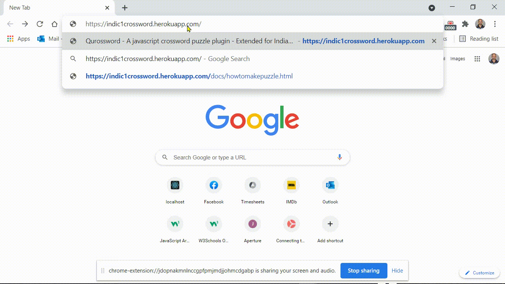

# Indic1Crossword

Indic1Crossword is a fork of the Crossword by Jesse Weisbeck.
It supports various Indian Language Scripts.
You can share you own crossword puzzles (see video under How-to --> Make Puzzle (Video) at
https://indic1crossword.herokuapp.com/

## Installation

https://github.com/vidyeshranade/Crossword.git

## Usage

 / ! 

## Features
	- Puzzle selection using Dropdown in various Menus
	- Clues buttons: Function as accordian (Open/ Close)
	- Show First/ Last Letter or Full Solution buttons
	- Top button to move to Top of the page
	- Spacebar/ Enter Key to move to next cell during input of answer
	- Allows to enter multi-byte Indian Language Script Character in single cell
	- Supports proper split of words into letters/ clusters
	- Split the word: Utility to use while build your own puzzle
	

## Contributing
Looking for a feature to add.
Which should enable end user to hook the puzzle into the application.

## Credits
The real magic of puzzle rendering is from the baseline (awsome) code by Jesse Weisbeck.
Also captured the features contributed by Mr. Kiki-L, Mr. Brad
Unicode functions taken from:
https://www.babelstone.co.uk/Unicode/unicode.html

## License
[MIT](https://choosealicense.com/licenses/mit/)

Creative Commons Licence:
CC BY-SA 3.0 <https://creativecommons.org/licenses/by-sa/3.0/>
unicode.js by Andrew West is licensed under a Creative Commons Attribution-ShareAlike 3.0 Unported License
